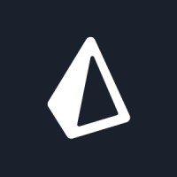

## Olá, sou Eduardo Cordeiro

Desenvolvedor fullstack com foco em backend. Trabalhei durante 2.5 anos em projetos React, NestJS, Express. Sempre disposto a aprender novas tecnologias!

## Tech Stacks
Algumas das tecnologias/linguagens que mais tenho experiência. 

---

<h3 align="left">Minhas redes (em construção):</h3>

  
---

